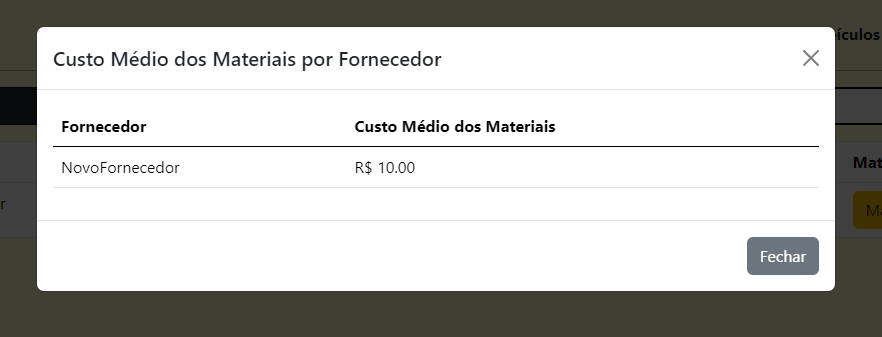
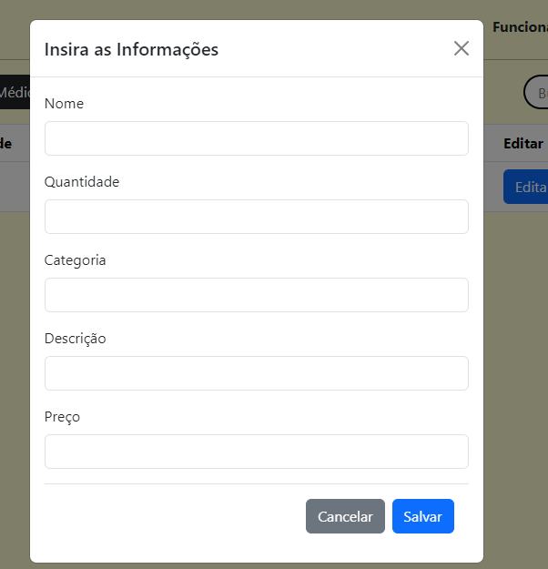

## 6. Interface do sistema

Nesta seção, serão apresentadas as interfaces do sistema com as quais o usuário terá contato, junto com detalhes de cada uma.

## 6.1. Tela de login do sistema

Na tela de login, o usuário irá digitar o nome de usuário e senha de acesso concedidos pela GLET para acessar as informações de sua aplicação.

## 6.2. Tela principal do sistema (home)

Na tela Home, o usuário terá botões que o levarão a todas as funcionalidades do sistema.

## 6.3. Telas do processo de funcionário

Na interface de funcionário, será possível visualizar, cadastrar e editar todos os funcionários associados à empresa.

Modal que é exibido para que o usuário possa cadastrar ou editar um novo funcionário.

Indicador que exibe o tamanho da empresa de acordo com o número de funcionários cadastrados no sistema.

## 6.4. Telas do processo de veículos

Na interface de veículos, será possível visualizar, cadastrar, excluir e editar todos os veículos associados à empresa, além de selecionar as manutenções de cada veículo.

Modal que é exibido para que o usuário possa cadastrar ou editar um novo veículo. Para editar, só será possível alterar o campo de carga.

## 6.5. Telas do subprocesso de manutenções

A tela de manutenções é única para cada veículo, onde será possível visualizar, cadastrar, excluir e editar todas as manutenções relacionadas ao veículo que o usuário clicou.

Modal que é exibido para que o usuário possa cadastrar ou editar uma nova manutenção.

Indicador de desempenho para as manutenções, exibindo a média de manutenções corretivas realizadas na vida útil de um veículo.

## 6.6. Telas do processo de fornecedores

Na interface de fornecedores, será possível visualizar, cadastrar, excluir e editar todos os fornecedores associados à empresa, além de selecionar os materiais fornecidos por cada fornecedor específico.

Modal que é exibido para que o usuário possa cadastrar ou editar um novo fornecedor.

Indicador de desempenho para fornecedores e materiais, exibindo o custo médio dos materiais de cada fornecedor.

## 6.7. Telas do subprocesso de materiais

A tela de materiais é única para cada fornecedor, onde será possível visualizar, cadastrar, excluir e editar todos os materiais relacionados ao fornecedor que o usuário clicou.

Modal que é exibido para que o usuário possa cadastrar ou editar um novo material.

## 6.8. Telas do processo de serviços

Na interface de serviços, será possível visualizar, cadastrar e editar todos os serviços realizados pela empresa. É importante ressaltar que só é possível cadastrar um serviço caso haja motoristas, ajudantes e veículos cadastrados previamente no sistema.

Modal que é exibido para que o usuário possa cadastrar ou editar um novo serviço.

Indicador de desempenho de serviços, que exibirá número de serviços, número de serviços concluídos e concluídos dentro do prazo, número de serviços a serem concluídos e a porcentagem de serviços concluídos dentro do prazo estipulado.

