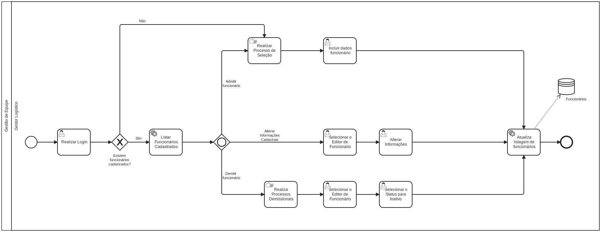

### 3.3.1 Processo 1 – Gestão de Equipe (Focado em Motoristas e Ajudantes)

#### Oportunidades de Melhoria:
- Implementação de categorização de habilidades e certificações para motoristas e ajudantes para facilitar o agendamento baseado em competências.
- Sistema de rastreamento de disponibilidade em tempo real para evitar conflitos de agendamento.
- Integração com o módulo de agendamento de serviços para automatizar a formação de equipes com base em disponibilidade e habilidades.

#### Modelo do Processo (BPMN):

**Atividades Principais:**

**Listar Funcionários Cadastrados**
- É exibida, uma vez que tenham funcionários cadastrados.
- Lista todos os funcionários cadastrados para aquele usuário.

**Solicita Cadastro de Funcionário**
- É exibido, uma vez que não existam funcionários cadastrados.
- Exibe mensagem na tela, solicitando cadastro de Funcionários.

**Realizar Processo de Seleção**
- Tarefa manual, realizada pelo pelo Gestor, ou responsável por buscar funcionários, a fim de contratá-los.

**Incluir Dados do Funcionário**
- Incluir os dados do funcionário, encontrados na tabela 1. "Cadastro de Motorista/ Ajuante".
- Confirmar os dados e salvar informações

  **Incluir tipo CNH**
- Inserir, dentro das informações de funcionário, o tipo da CNH dele, optando por Z, caso não tenha carteira ativa. 

**Atualiza listagem de funcionário**
- O sistema recebe as informações e atualiza o banco com  a listagem dos funcionários, que é exibido no inicio do processo.

**Selecionar Funcionário**
- Seleciona o funcionário dentre aqueles já previamente listados na tela.

  **Editar Informações**
- Usuário muda as informações dentro das seleções, conforme desejar.

  **Realiza Processos Demissionais**
- Tarefa manual, realizada pelo pelo Gestor, ou responsável por demitir funcionários, a fim de demití-los.

**Inativar Funcionário**
- Altera o status do funcionário na caixa de texto para "Inativado", para que ele não apareça ao selecionar funcionários, apenas em buscas ou ao selecionar Inativados.

#### Detalhamento das Atividades

**Realizar Login**
| **Campo**                   | **Tipo**       | **Restrições**           | **Valor default** |
|-----------------------------|----------------|--------------------------|-------------------|
| nomedeusuario/ email              | Caixa de texto |                          |                   |
| Senha              | Caixa de texto |                          |                   |

 **Incluir dados funcionário** 
| **Campo**                   | **Tipo**       | **Restrições**           | **Valor default** |
|-----------------------------|----------------|--------------------------|-------------------|
| Nome Completo               | Caixa de texto |                          |                   |
| CPF                         | Caixa de texto | 11 caracteres        |                   |
| Cargo                       | Caixa de texto  |       |                   |
| Tipo CNH  | Caixa de texto  | Caractere Único, optar pela CNH em atividade remunerada  |     |
| Data de Admissão            | Caixa de texto         |                          |         |
| Status                      | Caixa de Texto  |   |         |
| Observação                  | Caixa de texto | máximo de 1000 caracteres	 |                   |

| **Comandos**  | **Destino**                    | **Tipo** |
|---------------|--------------------------------|----------|
| Salvar        | Lista de Funcionários | default  |
| Cancelar      | Limpar formulário             | cancel   |

  **Selecionar o Editor de Funcionário**
| **Campo**  | **Destino**                    | **Tipo** |
|---------------|--------------------------------|----------|
| Editar        | Exibe Informações para Edição ou Visualização do Funcionário na linha  | Button  |

  **Alterar Informações** 
| **Campo**                   | **Tipo**       | **Restrições**           | **Valor default** |
|-----------------------------|----------------|--------------------------|-------------------|
| Nome Completo               | Caixa de texto |                          |                   |
| CPF                         | Caixa de texto | 11 caracteres        |                   |
| Cargo                       | Caixa de texto  |       |                   |
| Tipo CNH  | Caixa de texto  | Caractere Único, optar pela CNH em atividade remunerada  |     |
| Data de Admissão            | Caixa de texto         |                          |         |
| Status                      | Caixa de texto  |   |         |
| Observação                  | Caixa de texto | máximo de 1000 caracteres	 |                   |

**Selecionar o Status para Inativo**
| **Campo**  | **Destino**   | **Tipo** |
|---------------|--------------------------------|----------|
| Ativo       | Lista de Funcionários  | Dropdown  |
| Inativo       | Lista de Funcionários  | Dropdown  |
