### 3.3.2 Processo 2 – Gestão de Frota

#### Oportunidades de melhorias:
- Integração com o módulo de agendamento de serviços para automatizar a formação de frotas com base em requisitos para determinada operação, como por exemplo tipo de veículo.

#### Modelo do Processo (BPMN):

#### Atividades principais:

     
**Listar veículos**
   - Atividade de sistema, onde serão exibidos os veículos já cadastrados. Se não ouverem veículos, exibe mensagem solicitando um primeiro cadastro. Caso exista, segue o fluxo normalmente.
     
**Incluir dados do veículo (cadastro de um novo veículo)**
   - Usuário poderá adicionar um veículo. Para adicionar, clica em um botão de Adição e preenche com os campos solicitados.
     
**Selecionar veículo para exclusão (exclusão de veículo)**
   - Usuário poderá excluir um veículo. Para excluir, clica no botão de Exclusão para o respectivo veículo e confirma, conforme tarefa de usuário associada *Confirmar exclusão*.

**Confirmar exclusão**
   - Confirma a exclusão do veículo associado.

**Selecionar veículo para editar (edição de veículo)**
   - Usuário poderá editar um veículo. Para editar, clica no botão de Editar para o respectivo veículo e preenche os campos com seus novos valores, conforme tarefa de usuário associada *Edita veículo*.

**Edita veículo**
   - Ao usuário clicar no botão de Editar de um veículo, abre um Modal que permite ao usuário editar campos de veículo.
     
**Atualização da listagem**
   - Após as mudanças feitas pelo usuário, o sistema as salvará e adicionará ao banco de dados.
     
**Selecionar botão associado à manutenção**
   - Processo separado que demanda um tópico próprio. Para iniciar o processo, clica em um botão de manutenções para o veículo associado.[Clique aqui para visualizar o processo completo.](processo-5-gestao-de-manutencoes.md)

#### Detalhamento das atividades

**1. Realizar Login**
| **Campo**                   | **Tipo**       | **Restrições**           | **Valor default** |
|-----------------------------|----------------|--------------------------|-------------------|
| email                       | Caixa de texto |                          |                   |
| Senha                       | Caixa de texto |                          |                   |

| **Comandos**         |  **Destino**                   | **Tipo** |
| ---                  | ---                            | ---               |
| Login                | Página Home                    | submit            |

**2. Listar veículos**

*Atividade de sistema, portanto, não exige interação com o usuário*

**3. Incluir dados do veículo**
| **Campo**       | **Tipo**         | **Restrições** | **Valor default** |
| ---             | ---              | ---            | ---               |
| Modelo          | Caixa de texto   |                |                   |
| Placa           | Caixa de Texto   |  PK            |                   |
| Ano             | Número            | máximo de 4 caracteres |          |
| Capacidade de carga | Número        |                        |          |
| Tipo de veículo     | Seleção única | Caminhão, van, etc.    |          |

| **Comandos**         |  **Destino**                   | **Tipo** |
| ---                  | ---                            | ---               |
| Salvar               | Lista de veículos              | submit            |
| Cancelar             | Limpar formulário              | cancel            |

**4. Selecionar veículo para exclusão**
| **Comandos**         |  **Destino**                   | **Tipo** |
| ---                  | ---                            | ---               |
| Excluir              | Mensagem de confirmação        |                   |

**5. Confirmar exclusão**
| **Comandos**         |  **Destino**                   | **Tipo** |
| ---                  | ---                            | ---               |
| Cancelar             | Limpar formulário              | cancel            |
| Confirmar            | Lista de veículos              | submit            |

**6. Selecionar veículo para editar**
| **Comandos**         |  **Destino**                   | **Tipo** |
| ---                  | ---                            | ---               |
| Editar               | Modal de edição                |                   |

**7. Edita veículo**
| **Campo**       | **Tipo**         | **Restrições** | **Valor default** |
| ---             | ---              | ---            | ---               |
| Capacidade de carga | Número        |                        |          |

| **Comandos**         |  **Destino**                   | **Tipo** |
| ---                  | ---                            | ---               |
| Salvar               | Lista de veículos              | submit            |
| Cancelar             | Limpar formulário              | cancel            |

**8. Atualização da listagem**

*Atividade de sistema, portanto, não exige interação com o usuário*

**9. Selecionar botão associado à manutenção**
| **Comandos**         |  **Destino**                   | **Tipo** |
| ---                  | ---                            | ---               |
| Manutenções          | Página com manutenções do veículo em questão              |                   |
