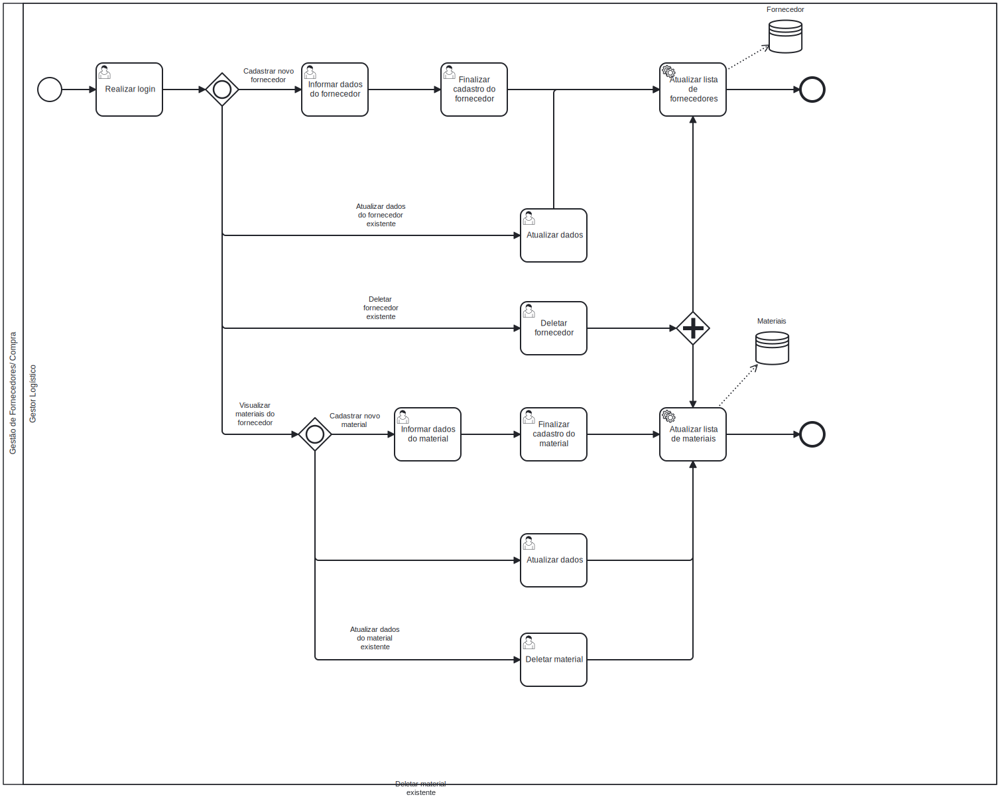

### 3.3.3 Processo 3 – Gestão de Fornecedores

#### Oportunidades de Melhoria:
- Integração do cadastro de materiais com o banco de dados de fornecedores, facilitando a associação e a verificação de disponibilidade e preços.
- Implementação de uma funcionalidade para adicionar novos fornecedores de forma ágil dentro do processo de compra.
- Criação de um sistema de avaliação de fornecedores, permitindo melhor escolha com base em critérios como preço, qualidade e tempo de entrega.

#### Modelo do Processo (BPMN):

**Atividades Principais:**

**1. Listar fornecedores:**
- É exibida, uma vez que tenham fornecedores cadastrados.
- Lista todos os fornecedores cadastrados.

**2. Cadastrar novo fornecedor**
- Preenche os dados referentes ao cadastro deu m novo fornecedor.

**3. Editar Fornecedor Existente:**
- Edita as informações desejadas de determinado fornecedor

**4. Deletar Fornecedor Existente:**
- Deleta o fornecedor desejado da lista de Fornecedores e os materiais vinculados a ele.

**5. Listar materiais:**
- É exibida, uma vez que tenham materiais cadastrados.
- Lista todos os materiais cadastrados referentes a determinado fornecedor.

**6. Cadastrar Novo Material:**
- Cadastra um material vinculado a um fornecedor previamente existente.

**7. Editar Material Existente:**
- Edita as informações desejadas de determinado material vinculado a um fornecedor previamente existente.

**8. Deletar Material Existente:**
- Deleta o material vinculado a um fornecedor previamente existente.

#### Detalhamento das Atividades

**Realizar Login**

| **Campo**                   | **Tipo**       | **Restrições**           | **Valor default** |
|-----------------------------|----------------|--------------------------|-------------------|
| nomedeusuario/ email              | Caixa de texto |                          |                   |
| Senha              | Caixa de texto |                          |                   |

**Informar dados do Fornecedor**

| **Campo**             | **Tipo**        | **Restrições**      | **Valor default** |
|-----------------------|-----------------|---------------------|-------------------|
| Nome  | Caixa de texto | >= 2 dígitos                    |                   |
| Contato               | Caixa de texto | 11 dígitos      |                  |
| Categoria             | Caixa de texto |  >= 2 dígitos                   |                   |
| CNPJ                  | Caixa de texto | 15 digitos       |                   |

**Finalizar cadastro do Fornecedor**

| **Comandos**          | **Destino**                      | **Tipo** |
|-----------------------|----------------------------------|----------|
| Salvar                | Fornecedores              | save |
| Cancelar              | Fornecedores               | cancel   |

**Atualizar dados**

| **Campo**             | **Tipo**        | **Restrições**      | **Valor default** |
|-----------------------|-----------------|---------------------|-------------------|
| Nome| Caixa de texto | >= 2 dígitos                    |                   |
| Contato               | Caixa de texto | 9 dígitos      |                  |
| Categoria             | Caixa de texto |      >= 2 dígitos               |                   |
| CNPJ                  | Caixa de texto | 15 digitos       |                   |

| **Comandos**          | **Destino**                      | **Tipo** |
|-----------------------|----------------------------------|----------|
| Salvar                | Fornecedores              | save |
| Cancelar              | Fornecedores              | cancel   |

**Deletar fornecedor**
| **Comandos**          | **Destino**                      | **Tipo** |
|-----------------------|----------------------------------|----------|
| Deletar               | Fornecedores              | delete  |
| Cancelar              | Fornecedores               | cancel   |

**Informar dados do material**

| **Campo**             | **Tipo**        | **Restrições**      | **Valor default** |
|-----------------------|-----------------|---------------------|-------------------|
| Nome                  | Caixa de texto   |  String, não pode ser nulo |                   |
| Quantidade              | Caixa de texto   | String, não pode ser nulo   |                   |
| Categoria             | Caixa de texto   |   String, não pode ser nulo|                   |
| Descrição             | Caixa de texto   |String                     |       null            |
| Categoria             | Caixa de texto   |String, não pode ser nulo  |                   |
| Preço                 | Caixa de texto   | double, maior que 0     |                   |

**Finalizar cadastro do material**

| **Comandos**          | **Destino**                      | **Tipo** |
|-----------------------|----------------------------------|----------|
| Salvar Material      | Materiais               | save |
| Cancelar              | Materiais              | cancel   |
      
**Atualizar dados**

| **Campo**             | **Tipo**        | **Restrições**      | **Valor default** |
|-----------------------|-----------------|---------------------|-------------------|
| Nome                  | Caixa de texto   |  String, não pode ser nulo |                   |
| Quantidade              | Caixa de texto   | String, não pode ser nulo   |                   |
| Categoria             | Caixa de texto   |   String, não pode ser nulo|                   |
| Descrição             | Caixa de texto   |String                     |       null            |
| Categoria             | Caixa de texto   |String, não pode ser nulo  |                   |
| Preço                 | Caixa de texto   | double, maior que 0     |                   |

| **Comandos**          | **Destino**                      | **Tipo** |
|-----------------------|----------------------------------|----------|
| Salvar Material      | Materiais              | save  |
| Cancelar              | Materiais                | cancel   |
               
**Deletar Material**
| **Comandos**          | **Destino**                      | **Tipo** |
|-----------------------|----------------------------------|----------|
| Deletar               | Materiais           | delete |
| Cancelar              | Materiais                | cancel   |

     

