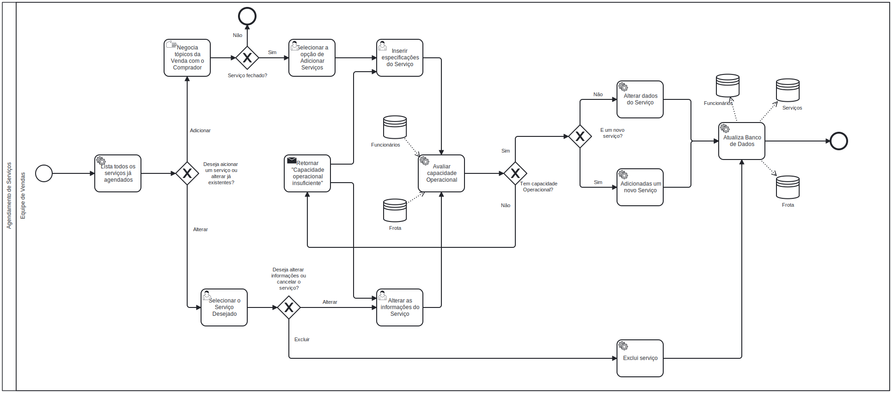

### 3.3.4 Processo 4 – Agendamento de Serviços

#### Oportunidades de Melhoria:
- Integração do cadastro de motoristas e ajudantes para seleção automática com base em disponibilidade e competências durante o agendamento de serviços.
- Implementação de um sistema de calendário para visualização de disponibilidade de veículos e pessoal.
- Criação de notificações e lembretes automáticos para revisão e confirmação dos serviços agendados.

#### Modelo do Processo (BPMN):

**Atividades Principais:**

**Lista todos os serviços ja agendados**
- Exibe para o usuario todos os serviços ja agendados.

**Negocia topicos da venda com o comprador**
- Tarefa manual, no qual o vendedor negocia com todos os detalhes do serviço com o cliente.

**Selecionar serviço desejado**
- Selecionamos o funcionário dentre aqueles já previamente listados na tela..
- Escolhemos entre as opçoes de alteração de serviço ou cancelamento.

**Alterar informaçoes do Serviço**
- O usuário pode mudar as informações dentro das opções, conforme desejar.

**Excluir Serviço**
- O usuario faz o cancelamento do serviço selecionado.

**Inserir especificações do serviço**
- Usuario fornece todo o detalhamento sobre o serviço.

**Avaliar capacidade operacional**
- O sistema avalia se o serviço se adequa a capacidade operacional da empresa.

**Retornar "capacidade operacinal insuficiente"**
- Exebibe na tela para o usuario que não e possivel fazer o serviço solicitado.

**Atualiza o banco de serviços**
- O sistema altera ou adiciona novas informações no banco de dados de serviços.

#### Detalhamento das Atividades

**1. Selecionar a opção de Adicionar Serviços**
| **Comandos**          | **Destino**                  | **Tipo** |
|-----------------------|------------------------------|----------|
| Adicionar Servico     | Modal de criação             |          |

**2. Inserir especificações do servico**

| **Campo**             | **Tipo**          | **Restrições**                | **Valor default** |
|-----------------------|-------------------|-------------------------------|-------------------|
| Nome do cliente       | Caixa de Texto    |                               |                   |
| Endereco              | Caixa de Texto    |                               |                   |
| Data de Agendamento   | Caixa de Texto    | Conter 10 caracteres          |                   |
| Previcao de termino   | Caixa de Texto    | Conter 10 caracteres          |                   |
| Data de Termino       | Caixa de texto    | Conter 10 caracteres ou nenhum| null              |
| Valor                 | Caixa de texto    | Conter apenas numeros         |                   |
| Motoristas            | Select            | Conter ao menos um selecionado|                   |
| Data de Agendamento   | Checkbox          | Conter ao menos um selecionado|                   |
| Data de Agendamento   | Checkbox          | Conter ao menos um selecionado|                   |

| **Comandos**          | **Destino**                  | **Tipo** |
|-----------------------|------------------------------|----------|
| Salvar                | Lista de Serviços            | Create   |
| Cancelar              | Desativa o modal             | Cancel   |

**3. Selecionar Servico Desejado**
| **Comandos**          | **Destino**                  | **Tipo** |
|-----------------------|------------------------------|----------|
| Editar Servico        | Modal de edição              |          |
| finalizar servico     | Lista de Servicos            | update   |

**4. Alterar informações do Servico**
| **Campo**             | **Tipo**          | **Restrições**                | **Valor default** |
|-----------------------|-------------------|-------------------------------|-------------------|
| Nome do cliente       | Caixa de Texto    |                               |                   |
| Endereco              | Caixa de Texto    |                               |                   |
| Data de Agendamento   | Caixa de Texto    | Conter 10 caracteres          |                   |
| Previcao de termino   | Caixa de Texto    | Conter 10 caracteres          |                   |
| Data de Termino       | Caixa de texto    | Conter 10 caracteres ou nenhum| null              |
| Valor                 | Caixa de texto    | Conter apenas numeros         |                   |
| Motoristas            | Select            | Conter ao menos um selecionado|                   |
| Data de Agendamento   | Checkbox          | Conter ao menos um selecionado|                   |
| Data de Agendamento   | Checkbox          | Conter ao menos um selecionado|                   |

| **Comandos**          | **Destino**                  | **Tipo** |
|-----------------------|------------------------------|----------|
| Salvar                | Lista de Serviços            | Update   |
| Cancelar              | Desativa o modal             | Cancel   |
| Excluir               | Lista de Serviços            | Delete   |

