### 3.3.5 Processo 5 – Gestão de manutenções 

#### Oportunidades de Melhoria:

- Indicação de oficinas confiáveis para o processo de manutenções, com base em avaliações do Google.

#### Modelo do Processo (BPMN):

#### Atividades principais:

**Listar manutenções**
   - Na tela de veículos, ao clicar em um botão associado a um veículo específico, carrega suas manutenções.

**Cadastro de manutenção**                        
   - Manualmente serão realizados os processos das manutenções nas oficinas, conforme atividades _Agendar Manutenção_ e _Realizar Manutenção_. Após conclusão, o usuário poderá cadastrar a manutenção no histórico do veículo.

**Edição de manutenção**
   - Caso uma manutenção tenha de ser reagendada, por exemplo, o usuário poderá realizar tal tarefa. Ao selecionar uma manutenção, conforme atividade _Selecionar botão associado à manutenção_, o usuário poderá mudar certos dados, conforme consta em _Alterar informações_.

**Exclusão de manutenção**
   - Caso o usuário decida deletar uma manutenção, basta o mesmo clicar no botão de deletar associado àquela tarefa, conforme consta na atividade _Selecionar botão associado à manutenção_, e confirmar a exclusão, conforme consta na atividade _Confirmar exclusão_.
     
**Salvar mudanças e atualizar listagem de manutenções**
   - Ao seguir um dos fluxos do tópico 2, 3 ou 4, as mudanças serão processadas pelo sistema e o mesmo fará um processo interno de atualização da lista e do banco de dados.

#### Detalhamento das atividades

**1. Inserir dados da manutenção**
| **Campo**       | **Tipo**         | **Restrições** | **Valor default** |
| ---             | ---              | ---            | ---               |
| Tipo de manutenção| Seleção única  | Preventiva, corretiva|                   |
| Oficina | Caixa de texto |       |        |
| Descrição         | Área de texto  |                      |                   |
| Data da manutenção| Data           |                      |                   |

| **Comandos**         |  **Destino**                   | **Tipo**          |
| ---                  | ---                            | ---               |
| Salvar               | Lista de manutenções           | default           |
| Cancelar             | Limpar formulário              | cancel            |

**2. Selecionar botão associado à manutenção**

*Para começar a edição ou exclusão, o usuário deverá clicar no botão "Editar" ou "Deletar" que estará na mesma linha da manutenção desejada.*

**3. Alterar informações**
| **Campo**       | **Tipo**         | **Restrições** | **Valor default** |
| ---             | ---              | ---            | ---               |
| Tipo de manutenção| Seleção única  | Preventiva, corretiva|                   |
| Oficina | Caixa de texto |       |        |
| Descrição         | Área de texto  |                      |                   |
| Data da manutenção| Data           |                      |                   |

| **Comandos**         |  **Destino**                   | **Tipo**          |
| ---                  | ---                            | ---               |
| Salvar               | Lista de manutenções           | default           |
| Cancelar             | Limpar formulário              | cancel            |

**4. Confirmar exclusão**
| **Comandos**         |  **Destino**                   | **Tipo**          |
| ---                  | ---                            | ---               |
| Confirmar            | Lista de manutenções           | default           |
| Cancelar             | Limpar formulário              | cancel            |
