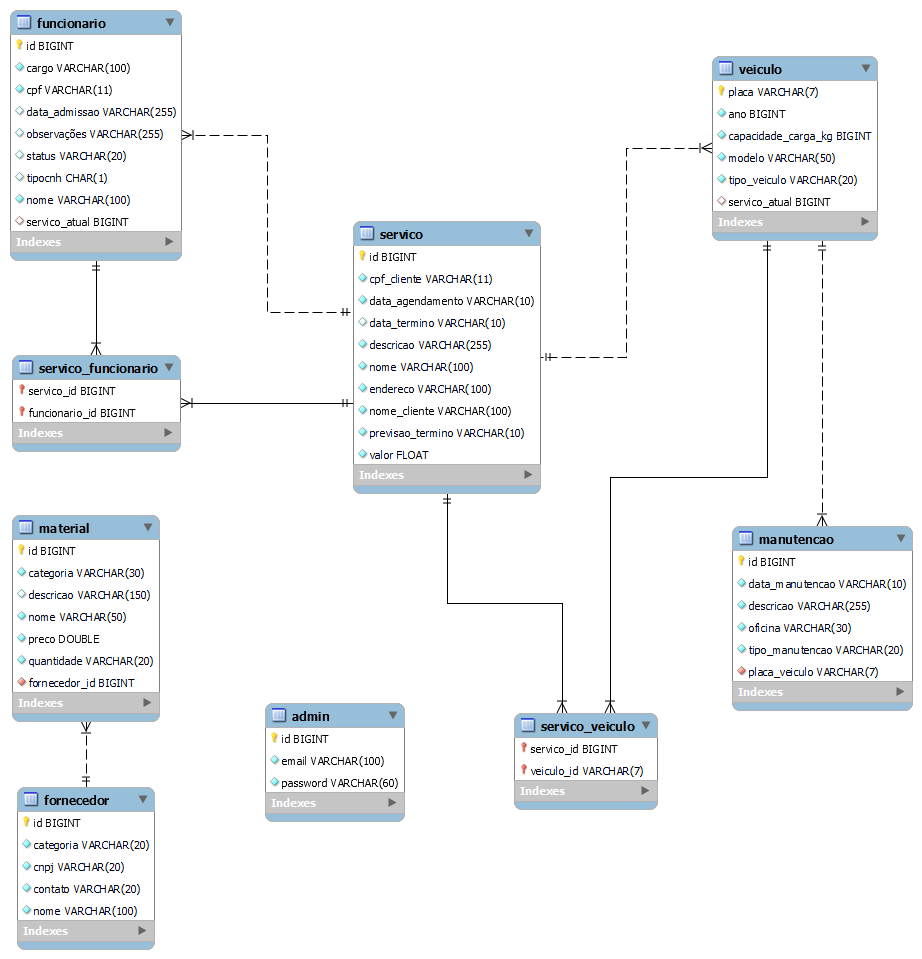

## 4. Projeto da solução

### 4.1. Modelo de dados

Modelo de dados conforme modelagem dos processos.

---

### 4.2. Tecnologias

| **Dimensão**   | **Tecnologia**  |
| ---            | ---             |
| SGBD           | MySQL           |
| Front end      | HTML+CSS+JS     |
| Back end       | Java+Spring Boot|
| Deploy         | https://dancing-bunny-b8cc2a.netlify.app    |

